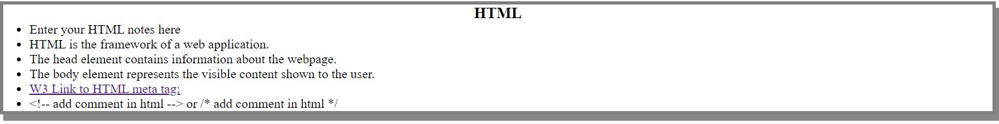
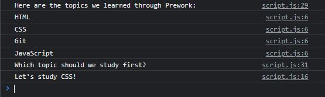

# <Prework-Study-Guide>

## Description

The Prework Study Guide is a good overview of HTML, CSS, Git, and JavaScript, with notes of each language's features and usage in their corresponding sections. Using this study guide, it solves a troubled bootcamp student's troubles with effectively studying and serves as a reference sheet in propelling a student's understanding of each language's functions.

From this project, I've honed my own basic understanding of each languages into one webpage. In a nutshell, HTML represents the framework and foundation of a web application, CSS can effectively style a web application's visuals, and JavaScript can add interactivity to the webpage. All three languages are implemented in the web application, and can be used in reference in tandem with the .css & .js files in the assets folder.

## Installation

N/A

## Usage

In the Prework Study Guide, each section on the different coding languages such as HTML, CSS, Git, & JS, would be separated by boxes to easily differentiate each topic.

In the DevTool's console, script.js incorporates a guide of the various topics and a specific topic for a student to focus and study in.

In some topics, there is reference to check files in the /assets folder in your preferred text editing software for examples on certain concepts such as functions, arrays, etc.

## Credits

N/A

## License

Please refer to the LICENSE in the repo.